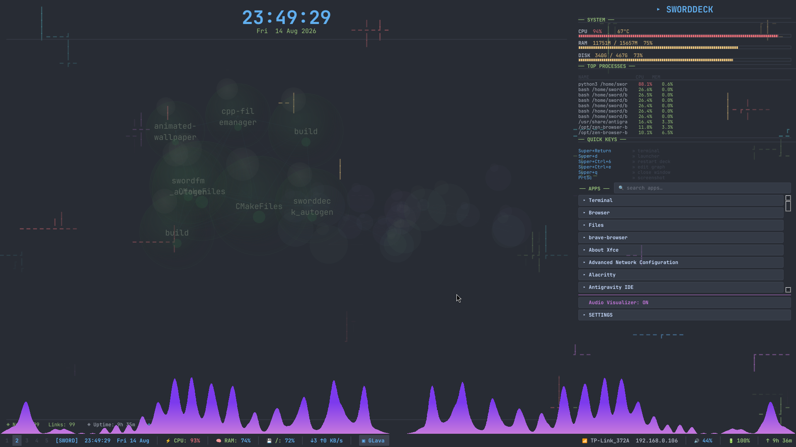
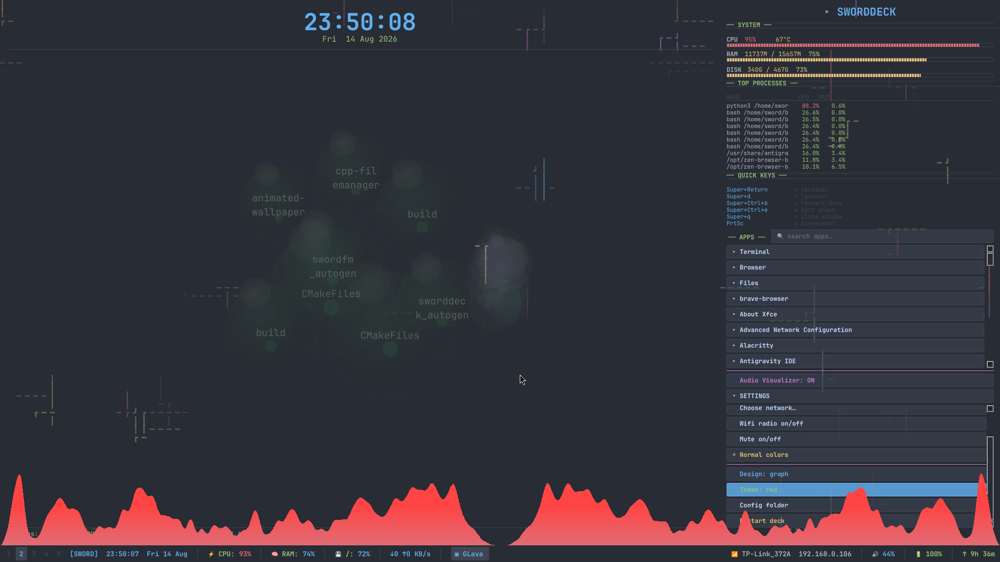
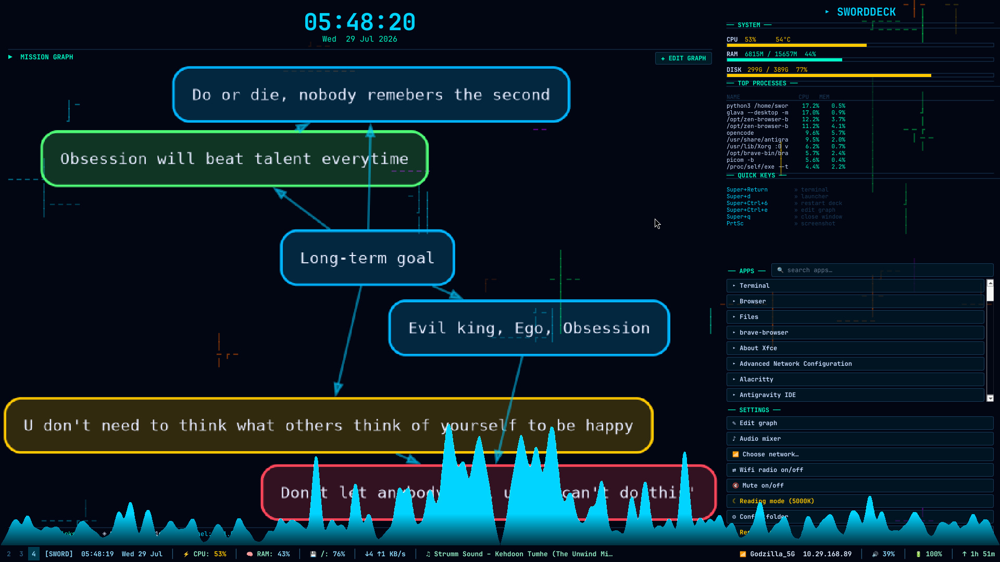
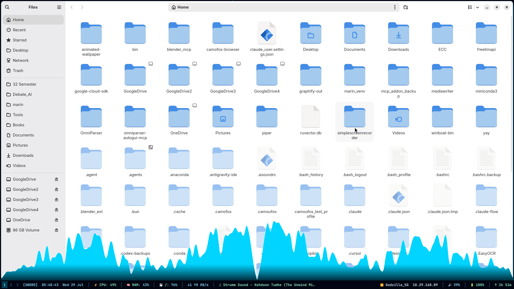
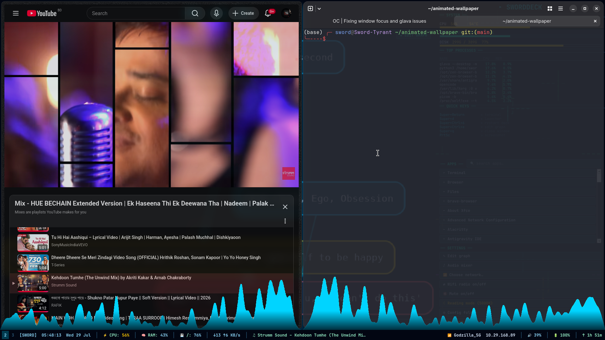

# Sworddeck — Animated Desktop HUD + Audio Visualizer for i3

A PySide6-powered animated desktop overlay that replaces your wallpaper with a full-featured cyberpunk HUD. Features a mission graph, system stats, app launcher, and a real-time audio visualizer (glava) layered behind everything.

## Screenshots

### SwordGraph — Animated Bubble Physics Layer


Each node in `~/.config/animated-wallpaper/graph.json` becomes a physical bubble with collision repulsion, elastic strings connecting neighbours, gentle drift, and boundary clamping. Bubbles stay inside the panel at all times and drag with the mouse.


### Cyberdeck with Glava Audio Visualizer


The cyberdeck with clock, mission graph, system stats, app launcher, and glava audio visualizer running at the bottom. Everything layers behind your apps.

### Real-World Usage — Apps Over Cyberdeck


Normal applications (YouTube, terminals) open on top of the cyberdeck while glava audio visualizer remains visible at the bottom edge.

### Full Desktop with File Manager


File manager open over the cyberdeck — glava visualizer visible at the bottom, cyberdeck panels behind the app.

## Window Stacking Order

```
┌─────────────────────────────────────────────────┐
│  Glava (audio visualizer, matrix rain)          │  ← TOP
│        transparent + click-through; never grabs │
│        mouse or keyboard focus                  │
├─────────────────────────────────────────────────┤
│  Normal Windows (browsers, terminals, etc.)     │  ← MIDDLE
├─────────────────────────────────────────────────┤
│  Cyberdeck (panels, clock, graphs, stats)       │  ← BOTTOM
└─────────────────────────────────────────────────┘
```

- **Glava**: `_NET_WM_STATE_ABOVE` — floating & sticky overlay on top of every
  window. Transparent background (ARGB + compositor) and empty input shape (`-ni`)
  so clicks/keys pass straight through to the app below. Launched via `xwinwrap -ov -ni -argb`.
- **Cyberdeck**: `_NET_WM_STATE_BELOW` — above the wallpaper, below all apps.
- All normal apps open on top of the cyberdeck automatically.

## Features

- **Animated Background** — gradient, particles, wave, matrix, or audio spectrum modes
- **Mission Graph** — visual node graph rendered via graphviz, editable through rofi
- **System Stats** — CPU, RAM, disk, network, top processes, battery, uptime
- **App Launcher** — quick-launch apps from a configurable list
- **Audio Visualizer** — glava spectrum on top of all windows (transparent & click-through; bottom strip)
- **Dock Bar** — replaces i3bar with workspaces, stats, wifi, volume
- **Quick Settings** — redshift, audio mixer, wifi toggle, mute toggle
- **One Dark Theme** — matching color scheme across all components

## Installation

### Prerequisites

- **i3 window manager** (or compatible tiling WM)
- **X11** (Wayland not supported)
- **Compositor** (picom for transparency/blur)
- **Ghostty** terminal (or kitty/alacritty)
- **Yazi** file manager (optional)
- **Fastfetch** system info (optional)

### Step 1: Install Packages

**Arch Linux:**
```bash
sudo pacman -S python-pyside6 glava jq graphviz rofi playerctl libnotify \
               xorg-xrandr pavucontrol redshift networkmanager \
               ttf-jetbrains-mono-nerd maim xdotool wmctrl picom \
               ghostty yazi fastfetch
```

**Debian/Ubuntu:**
```bash
sudo apt install python3-pyside6.qtwidgets glava jq graphviz rofi \
               playerctl libnotify-bin pavucontrol redshift \
               network-manager fonts-jetbrains-mono maim picom \
               xdotool wmctrl ghostty
```

### Step 2: Clone the Repository

```bash
git clone https://github.com/BayazidHabibSiddikee/CyberPaper.git ~/animated-wallpaper
cd ~/animated-wallpaper
chmod +x *.sh
```

### Step 3: Configure Terminal (Ghostty)

Create `~/.config/ghostty/config`:

```ini
# Font
font-family = JetBrainsMono Nerd Font
font-size = 11

# Window
window-padding-x = 16
window-padding-y = 16
window-decoration = false
background-opacity = 0.75

# Cursor
cursor-style = bar
cursor-style-blink = true

# Colors — One Dark
background = #282c34
foreground = #abb2bf
cursor-color = #528bff
cursor-text = #282c34
selection-background = #3e4451
selection-foreground = #282c34

palette = 0=#282c34
palette = 1=#e06c75
palette = 2=#98c379
palette = 3=#e5c07b
palette = 4=#61afef
palette = 5=#c678dd
palette = 6=#56b6c2
palette = 7=#abb2bf
palette = 8=#5c6370
palette = 9=#e06c75
palette = 10=#98c379
palette = 11=#e5c07b
palette = 12=#61afef
palette = 13=#c678dd
palette = 14=#56b6c2
palette = 15=#ffffff
```

### Step 4: Configure Yazi (Optional)

Create `~/.config/yazi/yazi.toml`:

```toml
[mgr]
linemode       = "size"
show_hidden    = true
show_symlink   = true
sort_by        = "natural"
sort_dir_first = true

[preview]
wrap      = "no"
tab_size  = 2
max_width = 600
```

Create `~/.config/yazi/theme.toml` for One Dark colors (copy from this repo or see full theme in the repo).

### Step 5: Configure Fastfetch (Optional)

Create `~/.config/fastfetch/config.jsonc`:

```jsonc
{
  "logo": {
    "type": "small",
    "padding": { "top": 1, "left": 2, "right": 2 }
  },
  "display": { "separator": " → " },
  "modules": [
    "title", "separator", "os", "kernel", "uptime", "packages",
    "shell", "terminal", "de", "wm", "wmtheme", "separator",
    "cpu", "gpu", "memory", "swap", "disk", "separator",
    "localip", "battery", "locale", "break", "colors"
  ]
}
```

### Step 6: Configure Glava

```bash
# Copy default config
glava -C

# Set graph module
sed -i 's/#request mod bars/#request mod graph/' ~/.config/glava/rc.glsl

# Disable debug frames
sed -i 's/setprintframes true/setprintframes false/' ~/.config/glava/rc.glsl

# Set cyan theme colors (matches cyberdeck)
sed -i 's|mix(#802A2A, #4F4F92|mix(#00D4FF, #00FFC8|' ~/.config/glava/graph.glsl

# Optional: cap FPS to 30 for performance
sed -i 's/#request setframerate 0/#request setframerate 30/' ~/.config/glava/rc.glsl
```

### Step 7: Configure Picom (Transparency & Blur)

Create `~/.config/picom/picom.conf`:

```conf
# Backend
backend = "glx";
glx-no-stencil = true;

# Shadows
shadow = true;
shadow-radius = 12;
shadow-offset-x = -7;
shadow-offset-y = -7;
shadow-opacity = 0.6;
shadow-color = "#1a1b26";

# Fading
fading = true;
fade-in-step = 0.03;
fade-out-step = 0.03;

# Blur (dual_kawase)
blur-method = "dual_kawase";
blur-strength = 5;

# Opacity rules
opacity-rule = [
  "90:class_g = 'ghostty' && focused",
  "80:class_g = 'ghostty' && !focused",
  "100:class_g = 'GLava'",
  "100:class_g = 'conky'"
];

# Window type settings
wintypes:
{
  tooltip = { fade = true; shadow = true; opacity = 0.9; };
  dock = { shadow = false; clip-shadow-above = true; };
  dnd = { shadow = false; };
};
```

### Step 8: Configure i3

Add to `~/.config/i3/config`:

```bash
# Start cyberdeck on login
exec_always --no-startup-id ~/animated-wallpaper/cyberdesk.sh restart

# Keybinds
bindsym $mod+Ctrl+6      exec ~/animated-wallpaper/cyberdesk.sh restart
bindsym $mod+Ctrl+e      exec ~/animated-wallpaper/graph-edit.sh
bindsym $mod+Ctrl+Escape exec ~/animated-wallpaper/cyberdesk.sh stop
bindsym $mod+Shift+y     exec ghostty -e /usr/sbin/yazi

# Optional: auto-assign apps to workspace (uncomment if desired)
# assign [class="ghostty"]  $ws2
# assign [class="zen"]      $ws2
# assign [class="Chromium"] $ws2
```

**Disable i3bar** (the dock bar replaces it):
Comment out the entire `bar { ... }` block in your i3 config, then reload:
```bash
i3-msg reload
```

> **Note:** You lose the system tray (nm-applet, etc.). Use `stalonetray` if you need tray icons.

### Step 9: Start

```bash
cd ~/animated-wallpaper
./cyberdesk.sh start
```

Or restart anytime:
```bash
./cyberdesk.sh restart
```

## Launcher Commands

```bash
./cyberdesk.sh start     # Start cyberdeck + glava
./cyberdesk.sh stop      # Stop everything
./cyberdesk.sh restart   # Restart
./cyberdesk.sh status    # Check if running
./cyberdesk.sh edit      # Edit mission graph
./cyberdesk.sh glava-toggle  # Toggle audio visualizer
```

## Keybinds

| Keybind              | Action                    |
|----------------------|---------------------------|
| `Super+Return`       | Open terminal             |
| `Super+d`            | App launcher (rofi)       |
| `Super+Shift+y`      | Open yazi file manager    |
| `Super+Ctrl+6`       | Restart cyberdeck         |
| `Super+Ctrl+e`       | Edit mission graph        |
| `Super+Ctrl+Escape`  | Stop cyberdeck            |
| `Super+q`            | Close window              |
| `PrtSc`              | Screenshot                |

## File Structure

| File                | Purpose                                             |
|---------------------|-----------------------------------------------------|
| `cyberdesk.sh`      | Launcher — manages cyberdeck + glava processes       |
| `cyberdeck.py`      | Main window — panels, layout, X11 hints              |
| `main_panel.py`     | Clock, mission graph, pipes animation                |
| `right_panel.py`    | System stats, apps, settings, GLava toggle           |
| `bottom_bar.py`     | Dock bar — workspaces, stats, wifi, volume           |
| `spectrum_overlay.py` | Built-in audio spectrum (when glava disabled)      |
| `left_panel.py`     | Matrix rain / pipes animations                       |
| `pipes_layer.py`    | Animated pipes texture                               |
| `swordgraph_layer.py` | **Animated graph-bubble physics** — replaces static graph PNG with live simulation  |
| `graph-edit.sh`     | Rofi-based mission graph editor                      |
| `graph-render.sh`   | Renders graph.json → graph.png via graphviz          |
| `graph.default.json`| Default mission graph data                           |

Runtime config: `~/.config/animated-wallpaper/`
- `graph.json` / `graph.png` — mission graph data and rendered image
- `apps.json` — app launcher entries
- `cyberdeck.log` / `glava.log` — logs
- `cyberdeck.pid` / `glava.pid` — process tracking

## Buttons

### Center Panel
- **✚ EDIT GRAPH** — Opens rofi editor for mission graph (same as `Super+Ctrl+e`)

### Right Panel — APPS
- Quick-launch apps from `~/.config/animated-wallpaper/apps.json`
- **✚ Add app...** — Prompts via rofi to add new apps
- Auto-rebuilds within 3 seconds of file changes

### Right Panel — SETTINGS
- **✎ Edit graph** — Rofi graph editor
- **♪ Audio mixer** — Opens pavucontrol
- **⇄ Wifi on/off** — Toggles `nmcli radio wifi`
- **🔇 Mute on/off** — Toggles `pactl set-sink-mute`
- **☾ Reading mode (5000K)** / **☀ Normal colors** — Redshift toggle
- **⚙ Config folder** — Opens config directory
- **⟳ Restart deck** — Restarts cyberdeck
- **◉ GLava on/off** — Toggles audio visualizer

## Dock Bar

The dock bar replaces i3bar and shows:
- **Left:** Workspace buttons (click to switch, focused highlighted, urgent red)
- **Center:** Username, time/date, CPU, RAM, disk %, network speed, current track
- **Right:** WiFi SSID + IP, volume (mute-aware), battery % (amber ≤40%, red ≤20%), uptime

### SwordGraph Tuning

All parameters live in `swordgraph_layer.py` class constructor. Defaults work well for a typical single-monitor setup:

```python
# In swordgraph_layer.py (line ~64):
def __init__(self, widget, *,
             count=10,
             min_r_pct=0.15, max_r_pct=0.30,   # bubble size as % of panel shortest side
             interval_ms=50,                     # physics update interval (lower = smoother but more CPU)
             repulsion=10.0,                     # how hard bubbles push apart on contact
             drift=0.03,                         # ambient sinusoidal drift strength
             damping=0.97,                       # velocity retention per frame (lower = more energy loss)
             edge_margin=30,                     # px buffer from panel edges
             max_alpha=80,                       # fill opacity (0-255)
             ):
```

**Bigger bubbles:** raise `min_r_pct` / `max_r_pct` (e.g. `0.20` / `0.40`). Fewer nodes will fit — the code auto-caps visible nodes to avoid overlap chaos.

**Smoother / more CPU:** lower `interval_ms` (22 ms ≈ 45 fps). Default is 50 ms (20 fps) for low-CPU idle.

**More spread:** raise `repulsion` (default 10). Set very high (18+) for aggressive separation.

**Darker/brighter strings:** edit the `QColor.fromHsl(...)` call near line 128:
```python
# Cyan strings (default):
p.setPen(QColor.fromHsl(198, 85, 75, alpha))
# Black strings:
p.setPen(QColor(20, 20, 20, alpha))
# White strings:
p.setPen(QColor(240, 240, 240, alpha))
```

### Node Visibility Cap

To prevent 100+ nodes from overlapping, `MAX_SHOWN` caps the visualised set to the top-degree nodes:
```python
MAX_SHOWN = max(6, min(len(self._node_data), 8))  # adjust as needed
```

Lower this number for larger, more spread-out bubbles. Higher for more nodes (smaller bubbles).

## Customization

### Column Widths
Edit in `cyberdeck.py`:
```python
LEFT_PCT   = 28   # Left column width %
CENTER_PCT = 44   # Center column width %
RIGHT_PCT  = 28   # Right column width %
BOTTOM_H   = 32   # Dock bar height in pixels
```

### Glava Height
In `cyberdesk.sh`:
```bash
gh=$(( sh * 22 / 100 ))   # Bottom 22% of screen
```

### Colors
- Cyberdeck colors: `QColor` constants at top of each panel file
- Terminal colors: `~/.config/ghostty/config` (or kitty.conf)
- Glava spectrum: `~/.config/glava/graph.glsl`
- Redshift warmth: change `5000` in `right_panel.py`

### Glava Module
Swap `-m graph` in `cyberdesk.sh` for other modules:
- `bars` — bar equalizer
- `wave` — waveform
- `radial` — radial visualizer

## Troubleshooting

| Issue | Solution |
|-------|----------|
| **Deck invisible** | Is picom running? Check `~/.config/animated-wallpaper/cyberdeck.log` |
| **Flat spectrum** | Glava only draws while audio plays; see `glava.log` |
| **Buttons dead** | They need exposed desktop; use keybinds when covered |
| **Glava glow/shadow** | Add `shadow-exclude = ["name = 'GLava'"]` to picom.conf |
| **Wrong screen size** | Run `cyberdeck.py --screen 2560x1440` (auto-detects by default) |
| **Apps open behind deck** | Run `./cyberdesk.sh restart` to re-apply X11 hints |
| **Glava on top of apps** | Ensure `xdotool` and `wmctrl` are installed |
| **Yazi won't open** | Make sure `ghostty` is installed, or use `kitty`/`alacritty` |
| **Colors look wrong** | Reload picom: `pkill picom; picom -b --config ~/.config/picom/picom.conf &` |

## License

MIT
