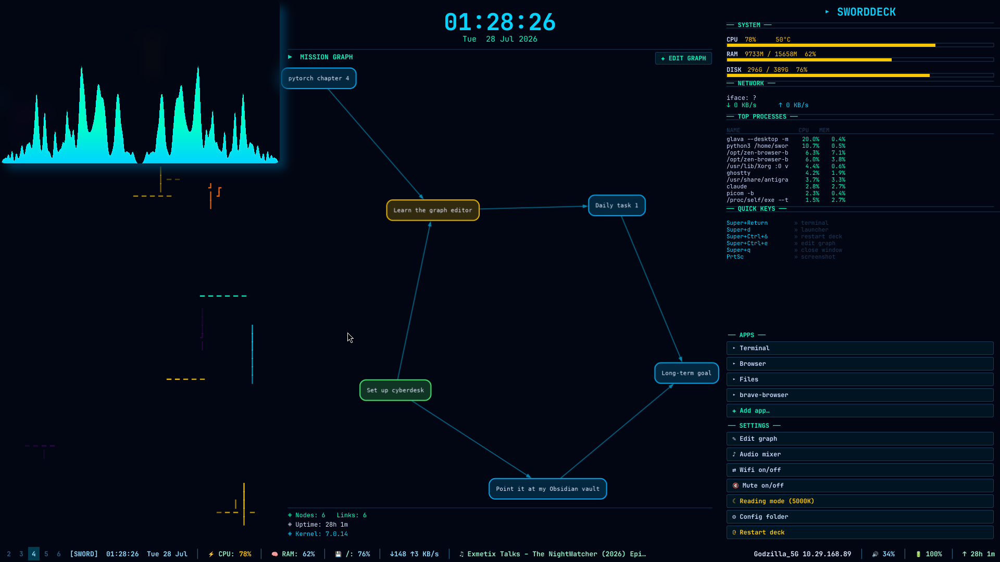

# Sworddeck — Animated Desktop HUD + Audio Visualizer for i3

A PySide6-powered animated desktop overlay that replaces your wallpaper with a full-featured cyberpunk HUD. Features a mission graph, system stats, app launcher, and a real-time audio visualizer (glava) layered behind everything.

## Screenshots

### Cyberdeck with Glava Audio Visualizer


The cyberdeck with clock, mission graph, system stats, app launcher, and glava audio visualizer running at the bottom. Everything layers behind your apps.

### Real-World Usage — Apps Over Cyberdeck


Normal applications (YouTube, terminals) open on top of the cyberdeck while glava audio visualizer remains visible at the bottom edge.

### Full Desktop with File Manager


File manager open over the cyberdeck — glava visualizer visible at the bottom, cyberdeck panels behind the app.

## Window Stacking Order

```
┌─────────────────────────────────────────────────┐
│  Normal Windows (browsers, terminals, etc.)     │  ← TOP
├─────────────────────────────────────────────────┤
│  Cyberdeck (panels, clock, graphs, stats)       │  ← MIDDLE
├─────────────────────────────────────────────────┤
│  Glava (audio visualizer, matrix rain)          │  ← BOTTOM
└─────────────────────────────────────────────────┘
```

- **Glava**: `_NET_WM_WINDOW_TYPE_DESKTOP` — absolute lowest layer
- **Cyberdeck**: `_NET_WM_STATE_BELOW` — above glava, below all apps
- All apps open on top automatically

## Features

- **Animated Background** — gradient, particles, wave, matrix, or audio spectrum modes
- **Mission Graph** — visual node graph rendered via graphviz, editable through rofi
- **System Stats** — CPU, RAM, disk, network, top processes, battery, uptime
- **App Launcher** — quick-launch apps from a configurable list
- **Audio Visualizer** — full-screen glava graph behind the cyberdeck
- **Dock Bar** — replaces i3bar with workspaces, stats, wifi, volume
- **Quick Settings** — redshift, audio mixer, wifi toggle, mute toggle

## Installation

### Prerequisites

- **i3 window manager** (or compatible tiling WM)
- **X11** (Wayland not supported)
- **Compositor** (picom recommended for transparency)

### Step 1: Install Packages

**Arch Linux:**
```bash
sudo pacman -S python-pyside6 glava jq graphviz rofi playerctl libnotify \
               xorg-xrandr pavucontrol redshift networkmanager \
               ttf-jetbrains-mono maim xdotool wmctrl picom
```

**Debian/Ubuntu:**
```bash
sudo apt install python3-pyside6.qtwidgets glava jq graphviz rofi \
               playerctl libnotify-bin pavucontrol redshift \
               network-manager fonts-jetbrains-mono maim picom \
               xdotool wmctrl
```

### Step 2: Clone the Repository

```bash
git clone https://github.com/BayazidHabibSiddikee/CyberPaper.git ~/animated-wallpaper
cd ~/animated-wallpaper
chmod +x *.sh
```

### Step 3: Configure Glava

```bash
# Copy default config
glava -C

# Set graph module
sed -i 's/#request mod bars/#request mod graph/' ~/.config/glava/rc.glsl

# Disable debug frames
sed -i 's/setprintframes true/setprintframes false/' ~/.config/glava/rc.glsl

# Set cyan theme colors (matches cyberdeck)
sed -i 's|mix(#802A2A, #4F4F92|mix(#00D4FF, #00FFC8|' ~/.config/glava/graph.glsl
```

### Step 4: Configure i3

Add to `~/.config/i3/config`:

```bash
# Start cyberdeck on login
exec_always --no-startup-id ~/animated-wallpaper/cyberdesk.sh restart

# Keybinds
bindsym $mod+Ctrl+6      exec ~/animated-wallpaper/cyberdesk.sh restart
bindsym $mod+Ctrl+e      exec ~/animated-wallpaper/graph-edit.sh
bindsym $mod+Ctrl+Escape exec ~/animated-wallpaper/cyberdesk.sh stop
```

**Disable i3bar** (the dock bar replaces it):
Comment out the entire `bar { ... }` block in your i3 config, then reload:
```bash
i3-msg reload
```

> **Note:** You lose the system tray (nm-applet, etc.). Use `stalonetray` if you need tray icons.

### Step 5: Start

```bash
./cyberdesk.sh start
```

Or restart anytime:
```bash
./cyberdesk.sh restart
```

## Launcher Commands

```bash
./cyberdesk.sh start     # Start cyberdeck + glava
./cyberdesk.sh stop      # Stop everything
./cyberdesk.sh restart   # Restart
./cyberdesk.sh status    # Check if running
./cyberdesk.sh edit      # Edit mission graph
```

## Keybinds

| Keybind              | Action                    |
|----------------------|---------------------------|
| `Super+Return`       | Open terminal             |
| `Super+d`            | App launcher (rofi)       |
| `Super+Ctrl+6`       | Restart cyberdeck         |
| `Super+Ctrl+e`       | Edit mission graph        |
| `Super+q`            | Close window              |
| `PrtSc`              | Screenshot                |

## File Structure

| File                | Purpose                                             |
|---------------------|-----------------------------------------------------|
| `cyberdesk.sh`      | Launcher — manages cyberdeck + glava processes       |
| `cyberdeck.py`      | Main window — panels, layout, X11 hints              |
| `main_panel.py`     | Clock, mission graph, pipes animation                |
| `right_panel.py`    | System stats, apps, settings                         |
| `bottom_bar.py`     | Dock bar — workspaces, stats, wifi, volume           |
| `spectrum_overlay.py` | Built-in audio spectrum (when glava disabled)      |
| `left_panel.py`     | Matrix rain / pipes animations                       |
| `pipes_layer.py`    | Animated pipes texture                               |
| `graph-edit.sh`     | Rofi-based mission graph editor                      |
| `graph-render.sh`   | Renders graph.json → graph.png via graphviz          |
| `graph.default.json`| Default mission graph data                           |

Runtime config: `~/.config/animated-wallpaper/`
- `graph.json` / `graph.png` — mission graph data and rendered image
- `apps.json` — app launcher entries
- `cyberdeck.log` / `glava.log` — logs
- `cyberdeck.pid` / `glava.pid` — process tracking

## Buttons

### Center Panel
- **✚ EDIT GRAPH** — Opens rofi editor for mission graph (same as `Super+Ctrl+e`)

### Right Panel — APPS
- Quick-launch apps from `~/.config/animated-wallpaper/apps.json`
- **✚ Add app...** — Prompts via rofi to add new apps
- Auto-rebuilds within 3 seconds of file changes

### Right Panel — SETTINGS
- **✎ Edit graph** — Rofi graph editor
- **♪ Audio mixer** — Opens pavucontrol
- **⇄ Wifi on/off** — Toggles `nmcli radio wifi`
- **🔇 Mute on/off** — Toggles `pactl set-sink-mute`
- **☾ Reading mode (5000K)** / **☀ Normal colors** — Redshift toggle
- **⚙ Config folder** — Opens config directory
- **⟳ Restart deck** — Restarts cyberdeck

## Dock Bar

The dock bar replaces i3bar and shows:
- **Left:** Workspace buttons (click to switch, focused highlighted, urgent red)
- **Center:** Username, time/date, CPU, RAM, disk %, network speed, current track
- **Right:** WiFi SSID + IP, volume (mute-aware), battery % (amber ≤40%, red ≤20%), uptime

## Customization

### Column Widths
Edit in `cyberdeck.py`:
```python
LEFT_PCT   = 28   # Left column width %
CENTER_PCT = 44   # Center column width %
RIGHT_PCT  = 28   # Right column width %
BOTTOM_H   = 32   # Dock bar height in pixels
```

### Glava Height
In `cyberdesk.sh`:
```bash
gh=$(( sh * 22 / 100 ))   # Bottom 22% of screen
```

### Colors
- Cyberdeck colors: `QColor` constants at top of each panel file
- Glava spectrum: `~/.config/glava/graph.glsl`
- Redshift warmth: change `5000` in `right_panel.py`

### Glava Module
Swap `-m graph` in `cyberdesk.sh` for other modules:
- `bars` — bar equalizer
- `wave` — waveform
- `radial` — radial visualizer

## Troubleshooting

| Issue | Solution |
|-------|----------|
| **Deck invisible** | Is picom running? Check `~/.config/animated-wallpaper/cyberdeck.log` |
| **Flat spectrum** | Glava only draws while audio plays; see `glava.log` |
| **Buttons dead** | They need exposed desktop; use keybinds when covered |
| **Glava glow/shadow** | Add `shadow-exclude = ["name = 'GLava'"]` to picom.conf |
| **Wrong screen size** | Run `cyberdeck.py --screen 2560x1440` (auto-detects by default) |
| **Apps open behind deck** | Run `./cyberdesk.sh restart` to re-apply X11 hints |
| **Glava on top of apps** | Ensure `xdotool` and `wmctrl` are installed |

## License

MIT
